#  create_database.md
 - AUTHOR: xinzhiniepan
 - DATE: 2018-03-25 15:32

## 静默安装数据库

## dbca方式安装(图形化安装)
1. 可以选择创建或者管理数据库
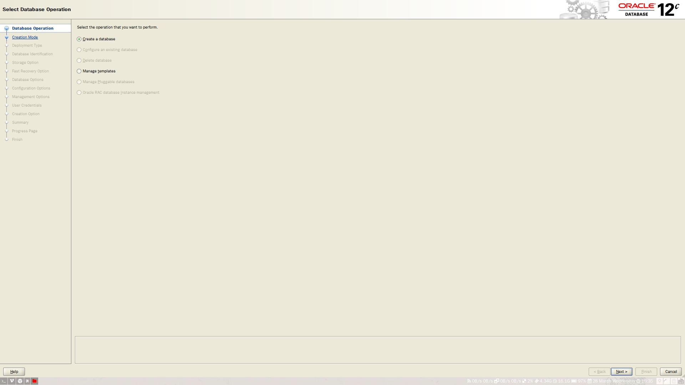

2. 选择高级安装或者典型安装(一般都是高级安装)
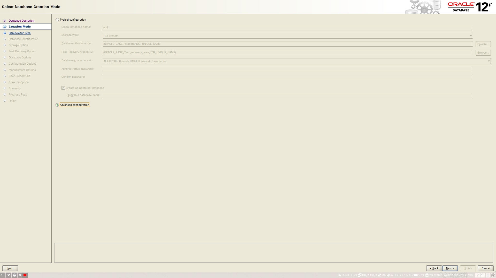

3. 数据库实例
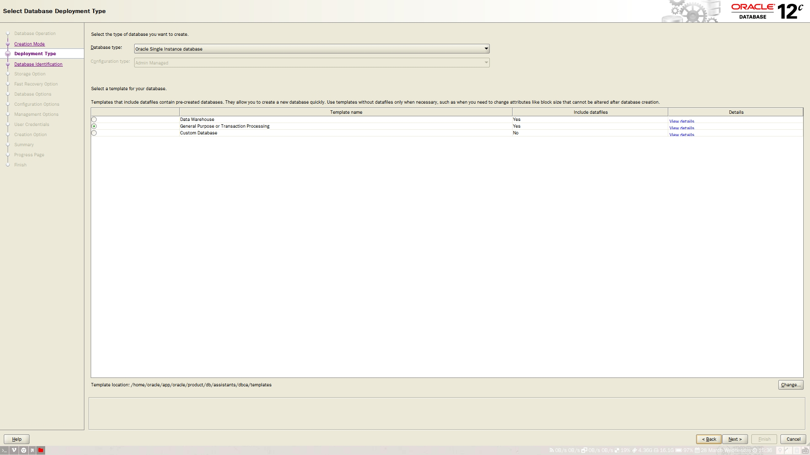

4. 数据库SID，以及CDB和PDB的选择

5. 数据库的保存属性(默认选项就好)
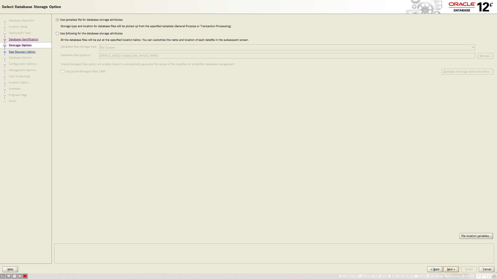

6. 数据库的recovery
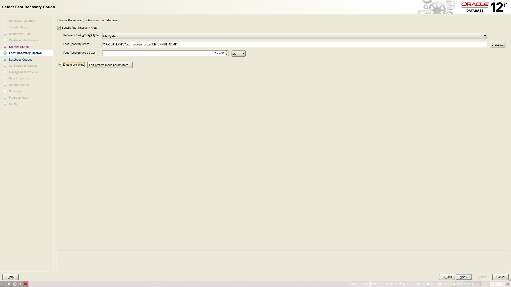

7. 监听器的选择
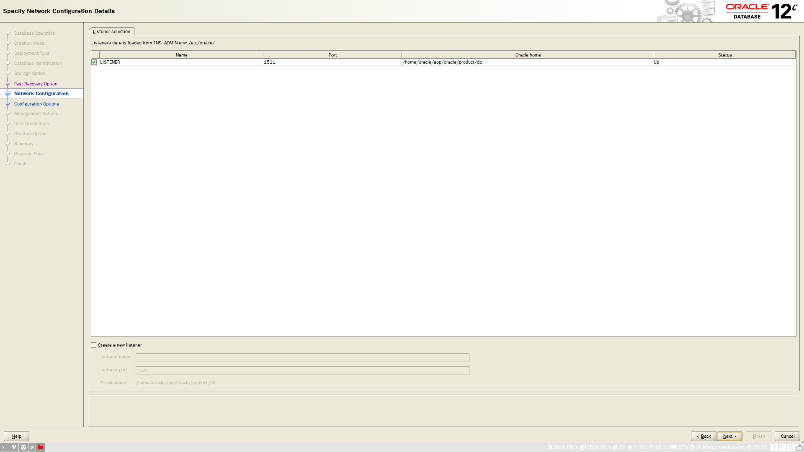

8. 数据库安全管理
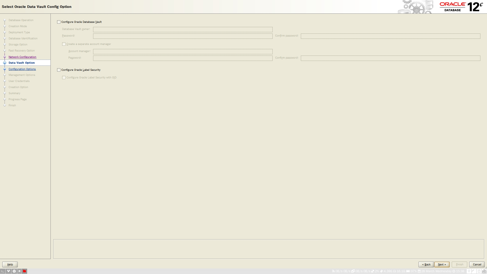

9. 内存管理
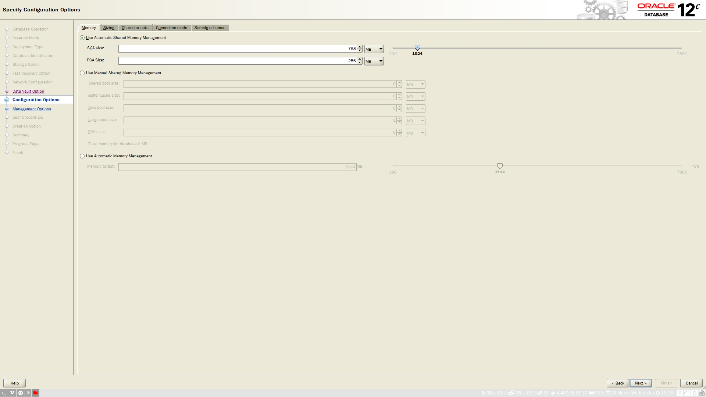

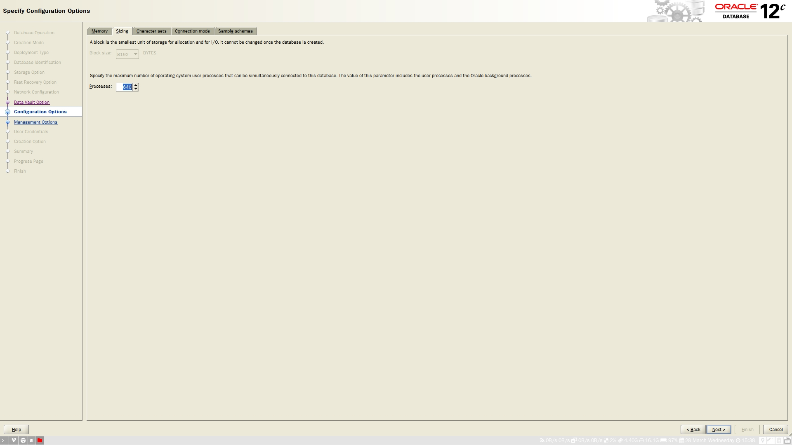

9. 字符设置（字符设置AL32UTF8，National character set:UTF-8, default language: ）
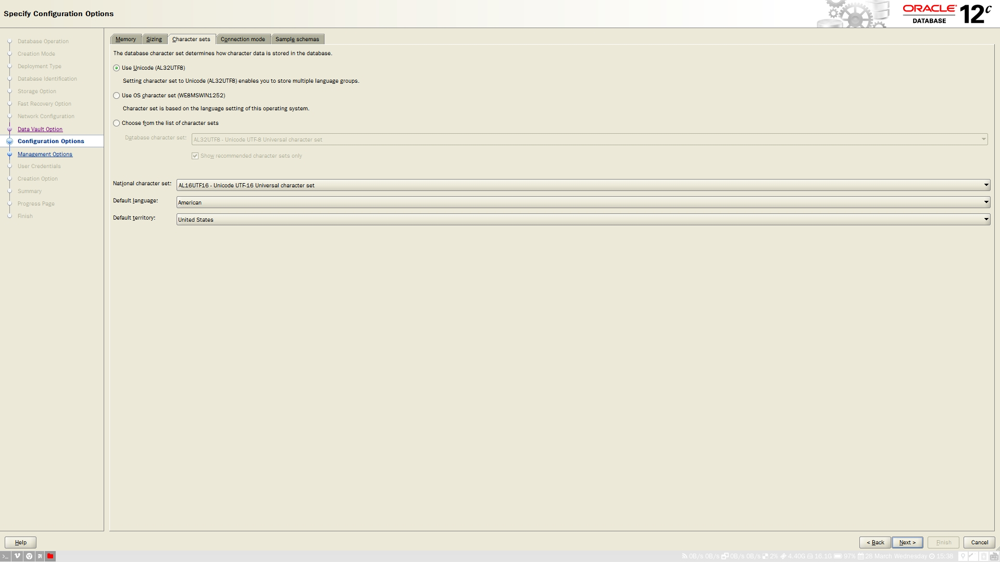

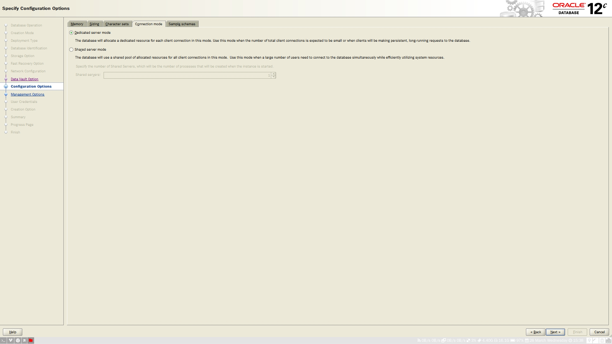

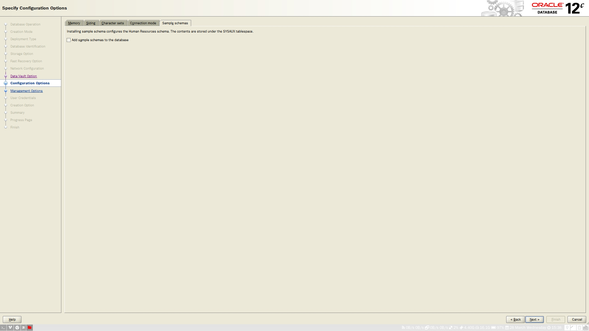

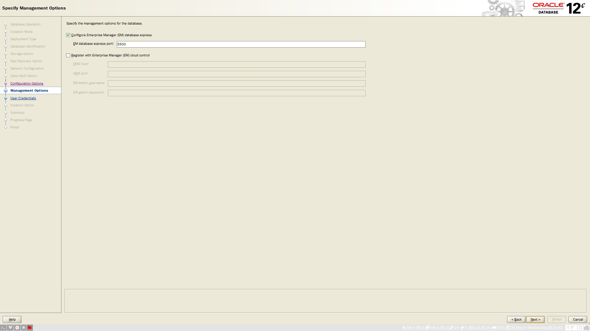

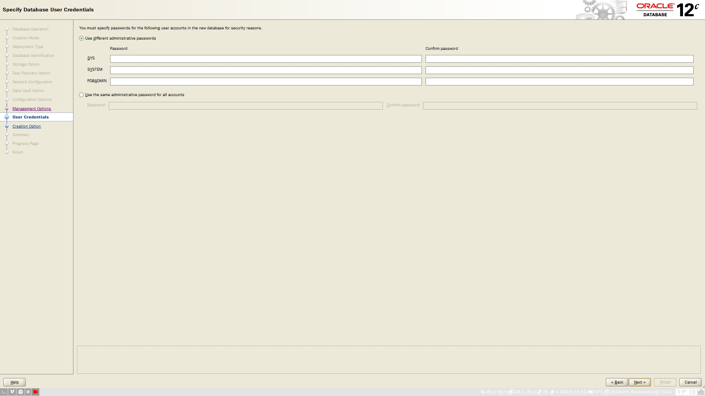

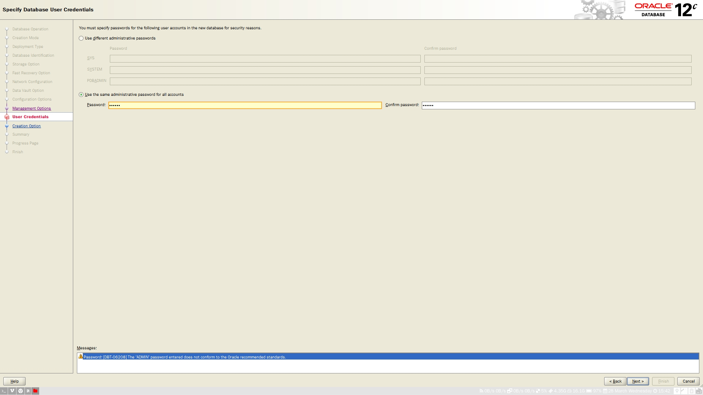

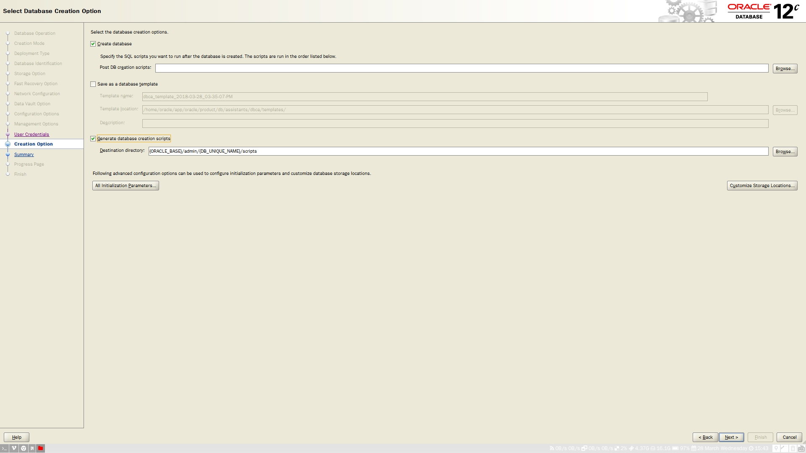

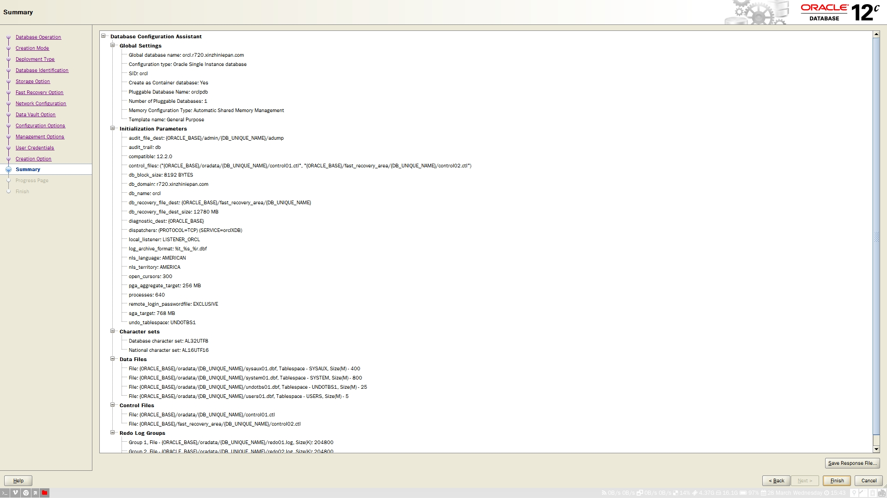

