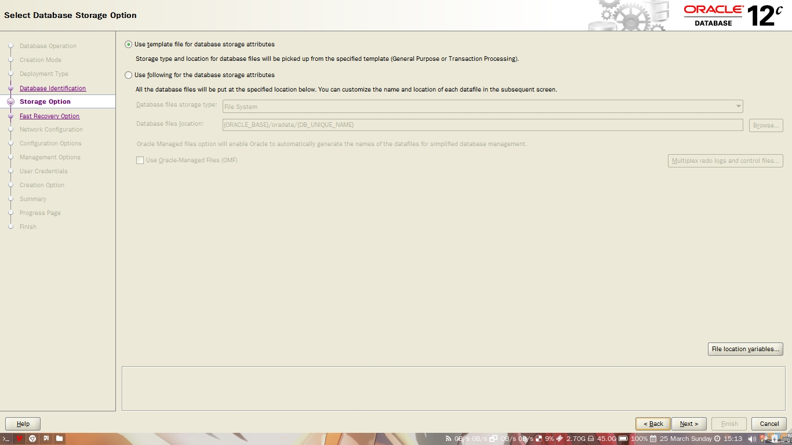
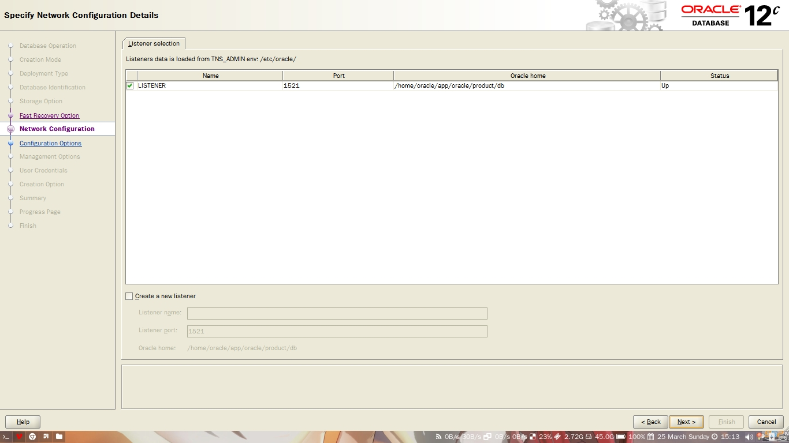
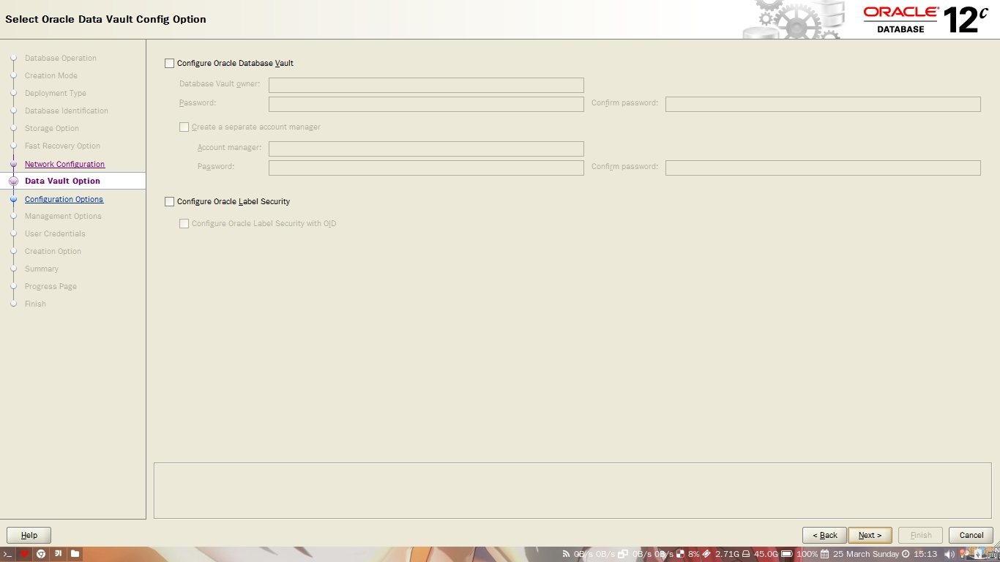
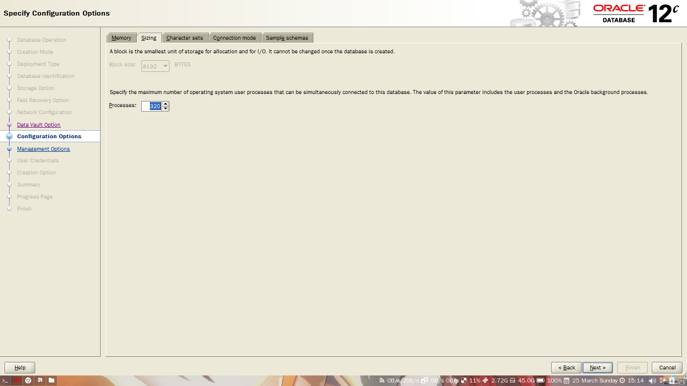
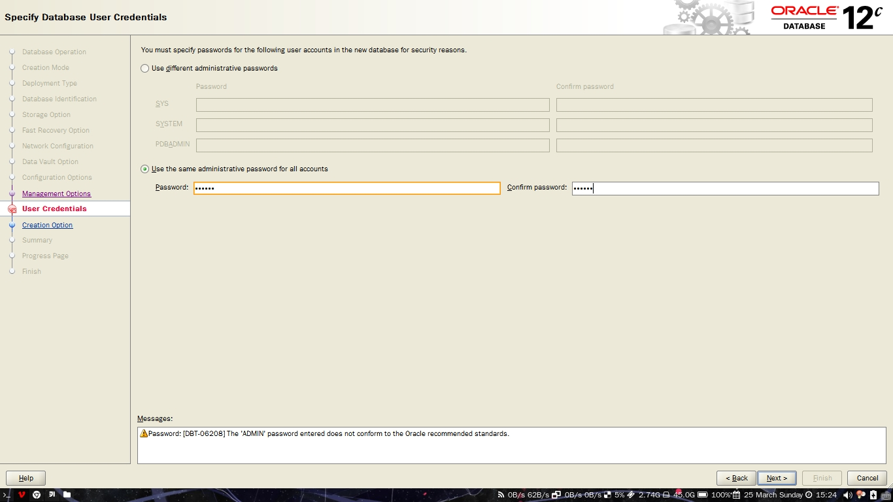
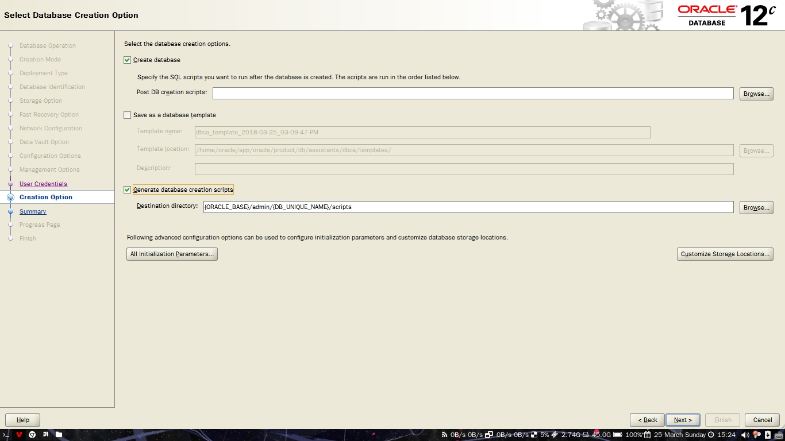

#  create_database.md
 - AUTHOR: xinzhiniepan
 - DATE: 2018-03-25 15:32

## dbca方式安装(图形化安装)
1. 可以选择创建或者管理数据库

2. 选择高级安装或者典型安装(一般都是高级安装)

3. 数据库实例

4. 数据库SID，以及CDB和PDB的选择

5. 数据库的保存属性(默认选项就好)

6. 监听器的选择

7. 数据库安全管理

8. 内存管理

9. 字符设置（字符设置选择中文，National character set:UTF-8, default language: ）

