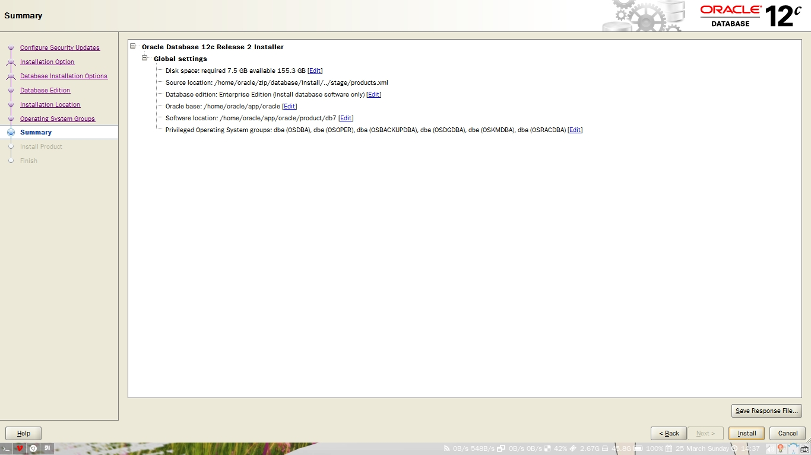

#  Oracle的安装以及数据库的创建
 - AUTHOR: xinzhiniepan
 - DATE: 2018-03-25 09:53

## 静默安装(接oracle_before_install.md)
#### 先完成准备工作

## 手动安装
##### 设置号环境变量
解压源码
```
$ unzip linuxx64_12201_database.zip -d /home/oracle/resources/
```

拷贝响应文件(根据需要修改)
```
$ mkdir response
$ cp database/response/db_install.rsp response/               
```

修改响应文件汇总
```
oracle.install.responseFileVersion=/oracle/install/rspfmt_dbinstall_response_schema_v12.2.0
oracle.install.option=INSTALL_DB_SWONLY
UNIX_GROUP_NAME=oinstall
INVENTORY_LOCATION=/home/oracle/app/oraInventory
ORACLE_HOME=/home/oracle/app/oracle/product/db
ORACLE_BASE=/home/oracle/app/oracle
oracle.install.db.InstallEdition=EE
oracle.install.db.OSDBA_GROUP=dba
oracle.install.db.OSOPER_GROUP=oper
oracle.install.db.OSBACKUPDBA_GROUP=backupdba
oracle.install.db.OSDGDBA_GROUP=dgdba
oracle.install.db.OSKMDBA_GROUP=kmdba
oracle.install.db.OSRACDBA_GROUP=racdba
DECLINE_SECURITY_UPDATES=true
```

除去注释总的响应文件
```
oracle.install.responseFileVersion=/oracle/install/rspfmt_dbinstall_response_schema_v12.2.0
oracle.install.option=INSTALL_DB_SWONLY
UNIX_GROUP_NAME=oinstall
INVENTORY_LOCATION=/home/oracle/app/oraInventory
ORACLE_HOME=/home/oracle/app/oracle/product/db
ORACLE_BASE=/home/oracle/app/oracle
oracle.install.db.InstallEdition=EE
oracle.install.db.OSDBA_GROUP=dba
oracle.install.db.OSOPER_GROUP=oper
oracle.install.db.OSBACKUPDBA_GROUP=backupdba
oracle.install.db.OSDGDBA_GROUP=dgdba
oracle.install.db.OSKMDBA_GROUP=kmdba
oracle.install.db.OSRACDBA_GROUP=racdba
oracle.install.db.rac.configurationType=
oracle.install.db.CLUSTER_NODES=
oracle.install.db.isRACOneInstall=
oracle.install.db.racOneServiceName=
oracle.install.db.rac.serverpoolName=
oracle.install.db.rac.serverpoolCardinality=
oracle.install.db.config.starterdb.type=
oracle.install.db.config.starterdb.globalDBName=
oracle.install.db.config.starterdb.SID=
oracle.install.db.ConfigureAsContainerDB=
oracle.install.db.config.PDBName=
oracle.install.db.config.starterdb.characterSet=
oracle.install.db.config.starterdb.memoryOption=
oracle.install.db.config.starterdb.memoryLimit=
oracle.install.db.config.starterdb.installExampleSchemas=
oracle.install.db.config.starterdb.password.ALL=
oracle.install.db.config.starterdb.password.SYS=
oracle.install.db.config.starterdb.password.SYSTEM=
oracle.install.db.config.starterdb.password.DBSNMP=
oracle.install.db.config.starterdb.password.PDBADMIN=
oracle.install.db.config.starterdb.managementOption=
oracle.install.db.config.starterdb.omsHost=
oracle.install.db.config.starterdb.omsPort=
oracle.install.db.config.starterdb.emAdminUser=
oracle.install.db.config.starterdb.emAdminPassword=
oracle.install.db.config.starterdb.enableRecovery=
oracle.install.db.config.starterdb.storageType=
oracle.install.db.config.starterdb.fileSystemStorage.dataLocation=
oracle.install.db.config.starterdb.fileSystemStorage.recoveryLocation=
oracle.install.db.config.asm.diskGroup=
oracle.install.db.config.asm.ASMSNMPPassword=
MYORACLESUPPORT_USERNAME=
MYORACLESUPPORT_PASSWORD=
SECURITY_UPDATES_VIA_MYORACLESUPPORT=
DECLINE_SECURITY_UPDATES=true
PROXY_HOST=
PROXY_PORT=
PROXY_USER=
PROXY_PWD=
COLLECTOR_SUPPORTHUB_URL=
```
### 开始静默安装
启动OUI安装器，指定响应文件，开始静默安装。
```
$ <INSTALL_DIR>/runInstaller -ignoreSysPrereqs -waitforcompletion -silent -responseFile <FULL PATH>
```
PS:
-responseFile 需要使用绝对路径，相对路径会出错
-ignoreSysPrereqs 忽略系统检查，这会让你的生活更美好
-waitforcompletion 等待安装完成，如果不指定的话，安装过程会转到后台执行，不看日志的话，是不知道有没有安装完的。
```
[oracle@12col7-112 ~]$ /home/oracle/install/database/runInstaller -ignoreSysPrereqs -waitforcompletion -silent -responseFile /home/oracle/silent-install/response/db_install.rsp
Starting Oracle Universal Installer...
Checking Temp space: must be greater than 500 MB.   Actual 39345 MB    Passed
Checking swap space: must be greater than 150 MB.   Actual 3967 MB    Passed
Preparing to launch Oracle Universal Installer from /tmp/OraInstall2017-09-21_11-47-25AM. Please wait ...You can find the log of this install session at:
/u01/app/oraInventory/logs/installActions2017-09-21_11-47-25AM.log
The installation of Oracle Database 12c was successful.
Please check '/u01/app/oraInventory/logs/silentInstall2017-09-21_11-47-25AM.log' for more details.
As a root user, execute the following script(s):
         1. /u01/app/oraInventory/orainstRoot.sh
         2. /u01/app/oracle/product/12.2.0/dbhome_1/root.sh
                 Successfully Setup Software.
```

按照提示切换到root用户执行脚本
```
[oracle@12col7-112 ~]$ su -
Password:
Last login: Thu Sep 21 10:41:14 CST 2017 from 192.168.56.1 on pts/0
[root@12col7-112 ~]# /u01/app/oraInventory/orainstRoot.sh
Changing permissions of /u01/app/oraInventory.
Adding read,write permissions for group.
Removing read,write,execute permissions for world.
Changing groupname of /u01/app/oraInventory to oinstall.
The execution of the script is complete.
[root@12col7-112 ~]#  /u01/app/oracle/product/12.2.0/dbhome_1/root.sh
Check /u01/app/oracle/product/12.2.0/dbhome_1/install/root_12col7-112.example.com_2017-09-21_11-56-20-903254406.log for the output of root script
```


## 图形安装




## [安装数据库](../database/create_database/create_database.md)
