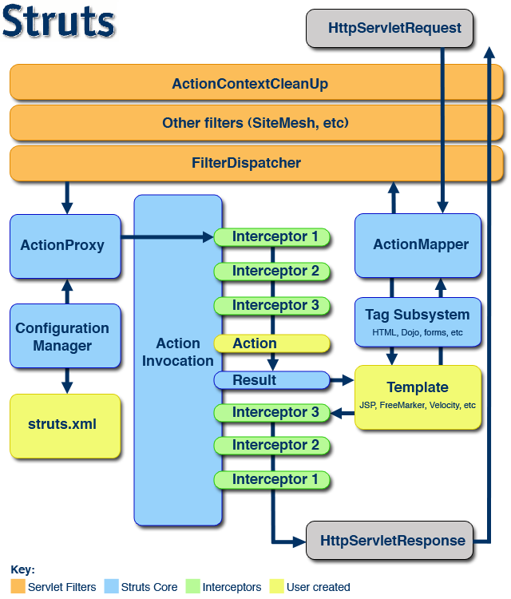

#  [struts2 拦截器(interceptors)](https://struts.apache.org/core-developers/interceptors.html)
 - AUTHOR: xinzhiniepan
 - DATE: 2018-03-29 08:48

## 理解拦截器 

### 我对拦截器的一点理解
拦截器链是通过字符串来连接的，
所谓的终止执行时在跳出方法时不执行ActionInvocation.invoke()方法
通过改变拦截器的返回值可以改变相应的访问结果(改变响应的视图)

## 配置拦截器

### 配置
定义
```
<interceptors>
    <interceptor name="myTimer" class="org.hua.struts2.interceptor.MyTimer"></interceptor>
</interceptors>
```

使用
```
<action ...>
    <interceptor-ref name="myTimer></interceptor-ref>
</action>
```
<b>PS：一旦使用了自定义的拦截器，则默认的拦截器就会失效，这时候应该把默认的拦截器栈(defaultStack)添加进去</b>

例如
struts.xml
```
<?xml version="1.0" encoding="UTF-8"?>
<!DOCTYPE struts PUBLIC
    "-//Apache Software Foundation//DTD Struts Configuration 2.5//EN"
    "http://struts.apache.org/dtds/struts-2.5.dtd">

<struts>
    <constant name="struts.devMode" value="true" />
    <package name="ds" namespace="/" extends="struts-default">
        <interceptors>
            <!-- 定义拦截器 -->
            <interceptor name = "timetest" class = "org.hua.struts.action.interceptor.MytimerInterceptor" />
            <!-- 定义拦截器栈 -->
            <interceptor-stack name="interceptorStackName">
                <!--- 指定引用的拦截器栈 -->
                <interceptor-ref name="defaultStack"></interceptor-ref>
            </interceptor-stack>
        </interceptors>
        <!-- 定义默认的拦截器引用只有一个，多个的化定义成一个拦截器栈  -->
        <default-interceptor-ref name="defaultStack">
        </default-interceptor-ref>

        <action name="*User" class="org.hua.struts.action.UserAction" method="{1}">
            <interceptor-ref name="timetest"/>
            <!-- 自定义拦截器会导致默认的拦截器失效，必须重新引用默认的拦截器 -->
            <interceptor-ref name="defaultStack"/>
            <result name="login">/success.jsp</result>
            <result name="register">/success.jsp</result>
            <allowed-methods>login,register</allowed-methods>
        </action>
        <action name="login" class="org.hua.struts.action.UserAction" method="login">
            <result name="login">/success.jsp</result>
        </action>

        <action name="register" class="org.hua.struts.action.UserAction" method="register">
            <result name="register">/success.jsp</result>
        </action>
    </package>
</struts>

```

### 内置的拦截器
1. param拦截器: 将请求数据设置到Action中
2. staticParam拦截器：将配置文件中的<action>属性和<param>中的相关参数设置到对应的Action的属性中
3. servletConfig拦截器: Servlet API注入Action当中的简洁方法。
4. fileUpload拦截器：文件上传
5. validation拦截器：数据校验
6. workflow拦截器：错误终止
7. exception拦截器：异常

### 内置的拦截器栈
defaultStack拦截器栈


##  自定义拦截器
### 实现Interceptor接口
void init()
void destroy()
String intercept(ActionInvocation invocation) throws Exception
java
```
package org.hua.struts.action.interceptor;

 
/**
 * @author xinzhiniepan
 * @version 1.0
 * @since 2018-03-29 22:25:29
 */
import com.opensymphony.xwork2.interceptor.Interceptor;
import com.opensymphony.xwork2.Action;
import org.hua.struts.pojo.User;
import java.util.Map;
import com.opensymphony.xwork2.ActionInvocation;
import org.apache.logging.log4j.Logger;
import org.apache.logging.log4j.LogManager;
public class LoginInterceptor implements Interceptor
{
    private static final Logger logger = LogManager.getLogger();

    @Override
    public void init()
    {
        logger.info("初始化权限拦截器!");
    }

    @Override
    public void destroy()
    {
        logger.info("销毁权限拦截器!");
    }

    @Override
    public String intercept(ActionInvocation invocation) throws Exception
    {
        logger.info("开始权限拦截器!");
        Map session = invocation.getInvocationContext().getSession();
        User user = (User)session.get("user");
        if(user == null)
        {
            logger.info("返回首页!");
            return "logina"; // 一个action的result的name值, 以便完成相关操作
        }
        else
        {
            logger.info("登录成功!");
            return invocation.invoke();
        }
    }
}
```

struts.xml
```
<?xml version="1.0" encoding="UTF-8"?>
<!DOCTYPE struts PUBLIC
    "-//Apache Software Foundation//DTD Struts Configuration 2.5//EN"
    "http://struts.apache.org/dtds/struts-2.5.dtd">

<struts>
    <constant name="struts.devMode" value="true" />
    <package name="ds" namespace="/" extends="struts-default">
        <interceptors>
            <!-- 定义拦截器 -->
            <interceptor name = "timetest" class = "org.hua.struts.action.interceptor.MytimerInterceptor" />
            <interceptor name = "authorization" class = "org.hua.struts.action.interceptor.LoginInterceptor" />
            <interceptor-stack name="mydefault">
                <interceptor-ref name="defaultStack"/>
                <interceptor-ref name="timetest"/>
            </interceptor-stack>
        </interceptors>
        <!-- 定义默认的拦截器引用  -->
        <default-interceptor-ref name="mydefault"/>

        <global-results>
            <result name="logina">/login.jsp</result>
        </global-results>

        <action name="*User" class="org.hua.struts.action.UserAction" method="{1}">
            <result name="login">/success.jsp</result>
            <result name="register">/success.jsp</result>
            <allowed-methods>login,register</allowed-methods>
        </action>
        <action name="login" class="org.hua.struts.action.UserAction" method="login">
            <result name="login">/success.jsp</result>
        </action>

        <action name="register" class="org.hua.struts.action.UserAction" method="register">
            <interceptor-ref name="authorization"/>
            <result name="register">/success.jsp</result>
        </action>
    </package>
</struts>

```

<b>PS: 根据拦截器运行的特点，可以知道拦截器只会拦截请求Action的请求。直接请求页面没有效果</b>

### 继承AbstractInterceptor抽象方法

#### 文件下载
参数名要一致
java
```
package org.hua.struts.action;

 
/**
 * @author xinzhiniepan
 * @version 1.0
 * @since 2018-03-30 09:43:29
 */
import java.io.FileInputStream;
import java.io.InputStream;
import org.apache.struts2.ServletActionContext;
import java.io.BufferedInputStream;
public class DownLoadAction
{
    private String inputPath;
    private String fileName;
    private InputStream inputStream;

    public String download()
    {
        return "download";
    }

    public void setInputPath(String inputPath)
    {
        this.inputPath = inputPath;
    }

    public String getInputPath()
    {
        return inputPath;
    }

    public void setFileName(String fileName)
    {
        this.fileName = fileName;
    }

    public String getFileName()
    {
        return fileName;
    }

    public void setInputStream(InputStream inputStream)
    {
        this.inputStream = inputStream;
    }

    
    public InputStream getInputStream() throws Exception
    {
        String path = ServletActionContext.getServletContext().getRealPath(inputPath);

        System.out.println("战法大赛的符" + path + "   " + fileName);

        return new BufferedInputStream(new FileInputStream(path + "/" + fileName));
    }
}
```

struts.xml
```
<?xml version="1.0" encoding="UTF-8"?>
<!DOCTYPE struts PUBLIC
    "-//Apache Software Foundation//DTD Struts Configuration 2.5//EN"
    "http://struts.apache.org/dtds/struts-2.5.dtd">

<struts>
    <constant name="struts.devMode" value="true" />
    <package name="fileDownloads" namespace="/download" extends="struts-default">
        <action name="pic" class="org.hua.struts.action.DownLoadAction" method="download">
                <param name="inputPath">/upload</param>
            <result name="download" type="stream">
                <param name="contentType">application/octet-stream</param>
                <param name="inputName">inputStream</param>
                <param name="contentDisposition">attachment;filename="${fileName}"</param>
                <param name="bufferSize">2048</param>
            </result>
        </action>
    </package>
</struts>

```

jsp
```
...
    <a href="download/pic?fileName=twob03.jpeg">下载</a>
...
```

#### 文件上传
PS: Action中的三个属性要相匹配，这三个属性中改变的只能是uploads;
上传的文件`
List<File> uploads;
上传的文件名
List<String> uploadsName;
上传的文件类型
List<String> uploadsContentType;

```java
package org.hua.struts.action;

 
/**
 * @author xinzhiniepan
 * @version 1.0
 * @since 2018-03-30 00:22:53
 */
import org.apache.struts2.ServletActionContext;
import java.io.File;
import java.io.FileInputStream;
import java.io.FileOutputStream;
import java.util.List;
import com.opensymphony.xwork2.ActionSupport;
import org.apache.logging.log4j.Logger;
import org.apache.logging.log4j.LogManager;
public class UploadAction
{
    private List<File> uploads;
    private List<String> uploadsFileName;
    private List<String> uploadsContentType;
    private String savePath;

    private static final Logger logger = LogManager.getLogger();

    /**
     * 多文件上传
     * @return 返回的视图名
     */
    public String uploadMultiFile() throws Exception
    {
        byte[] buffer = new byte[1024];
        FileInputStream fis = null;
        FileOutputStream fos = null;

        for(int i = 0; i < uploads.size(); i++)
        {
            fis = new FileInputStream(getUploads().get(i));

            fos = new FileOutputStream(getSavePath() + "/" + getUploadsFileName().get(i));

            int length = fis.read(buffer);

            while(length > 0)
            {
                fos.write(buffer, 0, length);
                length = fis.read(buffer);
            }
        }

        fis.close();
        fos.flush();
        fos.close();
        return "success";
    }


    public void setUploads(List<File> uploads)
    {
        this.uploads = uploads;
    }

    public List<File>  getUploads()
    {
        return uploads;
    }

    public void setUploadsFileName(List<String> uploadsFileName)
    {
        this.uploadsFileName = uploadsFileName;
    }

    public List<String> getUploadsFileName()
    {
        return uploadsFileName;
    }

    public void setUploadsContentType(List<String> uploadsContentType)
    {
        this.uploadsContentType = uploadsContentType;
    }

    public List<String> getUploadsContentType()
    {
        return uploadsContentType;
    }

    public void setSavePath(String savePath)
    {
        this.savePath = savePath;
    }

    public String getSavePath()
    {
        return ServletActionContext.getServletContext().getRealPath(savePath);
    }
}
```

struts.xml
```
...
        <action name="uploadMultiFile" class="org.hua.struts.action.UploadAction" method="uploadMultiFile">
            <param name="savePath">/upload</param>
            <result name="success">/upload_success.jsp</result>
        </action>
...
```

jsp
```jsp
    <s:form action="uploadSingle.action" enctype="multipart/form-data" method="post">
        <s:textfield name="title" label="标题"/>
        <s:file name="uploads" label="选择文件"/>
        <s:file name="uploads" label="选择文件"/>
        <s:file name="uploads" label="选择文件"/>
        <s:file name="uploads" label="选择文件"/>
        <s:submit value="上传" />
    </s:form>

```
